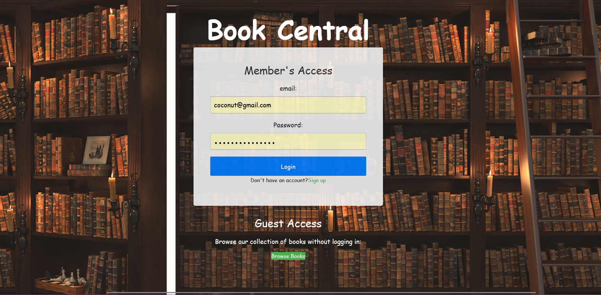
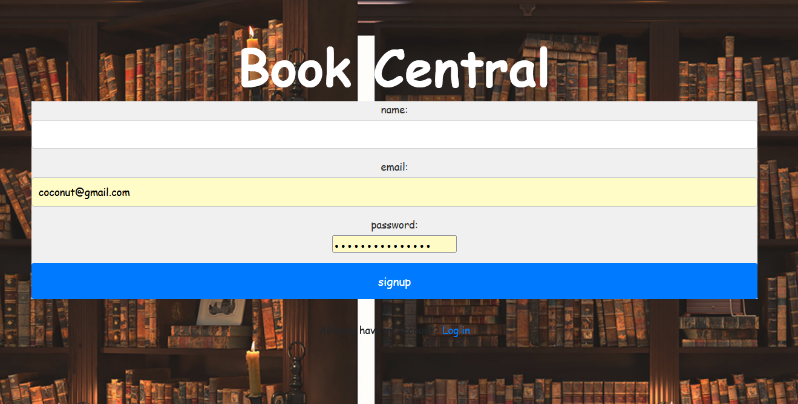
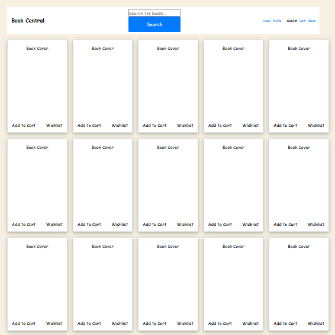
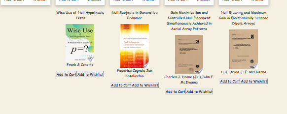
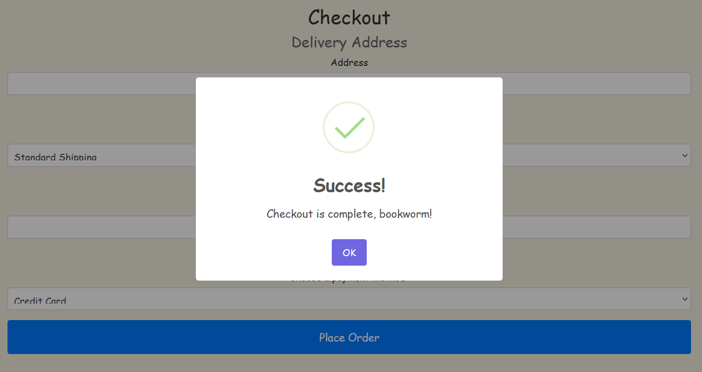
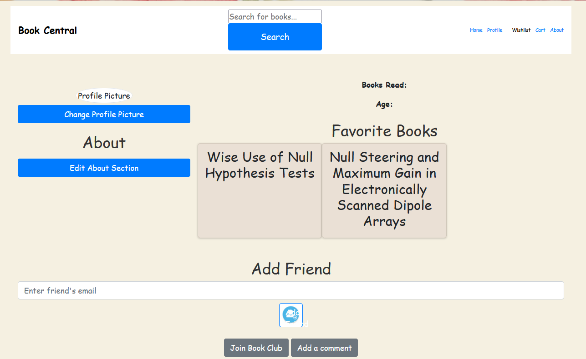

# <h1 align="center">Book Central </h1>
Project 2

## Table of Contents

*  [Description](#description)
          
          
*  [Live-URL-of-Deployed-Application](#live-url-of-deployed-application)
          

*  [Screenshots](#screenshots)
          
   
*  [Technologies-Used](#technologies-used)
           
          
*  [Installation](#installation)
           
    
*  [Usage-Information](#usage-information)
            
          
*  [License](#license)
           
         
*  [Questions](#questions)
           
          

##  Description 

Book-Central Online is a platform that offers a range of features to enhance your reading experience. With our website, you can enjoy the convenience of signing up and logging in to access a multitude of services. Whether you're looking for a specific book or just browsing for your next read, our advanced book search functionality will assist you in finding the perfect title. And to make things even better, we provide the option to purchase books directly through our website.

## Live-URL-of-Deployed-Application 

[Depoyed Website](https://bookwebnetwork.herokuapp.com/)
 
##  Live Screen Recording of Application Functionality 

## Screenshots 

## Technologies Used

Our coding project utilized Node.js and Express.js for creating a RESTful API, Handlebars.js as the template engine, MySQL with the Sequelize ORM for the database, and incorporated both GET and POST routes. Additionally, we embraced at least one new library or technology beyond our discussions. The project followed the MVC folder structure, implemented authentication with express-session and cookies, and ensured the protection of sensitive information through the use of environment variables. These technologies and practices contributed to the development of a robust and secure project.

## Installation

## Usage Information
Checkout books and view them in profile page.
## License

NOTICE: This application is covered under the MIT License

## Questions

Need more information? You can contact us through our Githubs provided down below: 

https://github.com/Slfdspln

https://github.com/Alexnuno17

https://github.com/ag-harry

https://github.com/hichamraffiaidrissi
